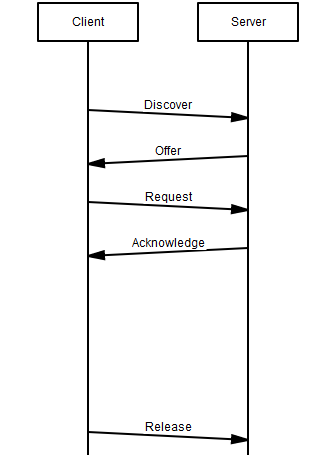
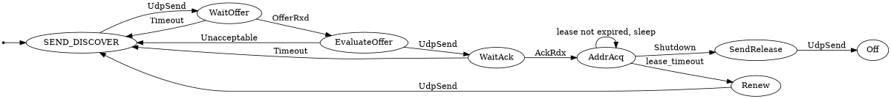

# copy of dhcpd

## Params

- `-c` : Client id
- `-H` : Host id
- `-h` : Host id
- `-f` : Do not fork after getting lease
- `-b` : for to background if lease cannot
         be immediately negotiated
- `-i` : interface to use (default eth0)
- `-n` : "now" exit with failure if lease cannot be immediately negotiated
- `-p` : store process ID of daemon infile
- `-q` : quit after obtaining lease
- `-r` : request the given IP (default manifest.json::default_ip)
- `--halp` : print help


## Features

### Support IPC to execute the next operations

#### Renew state
#### Force release of current lease
#### 

https://www.websequencediagrams.com/

### DHCP ops: `DORA`

Message sequence diagram of a common DHCP operation:
https://mscgen.js.org/

```msc
msc {
 arcgradient = 8;

 a [label="Client"],b [label="Server"];

 a=>b [label="Discover"];
 b=>a [label="Offer"];
 a=>b [label="Request"];
 b=>a [label="Acknowledge"];
 
 #|||;
 #a<=b [label="ack3"];
 |||;
 |||;
 |||;
 a=>b [label="Release"];
}
```



#### Discover 

#### Offer
#### Request 
#### Acknowledge


## Client FSM



- Checksum & endiannes
- reopen port on errors
- check for bogus packets
- support all DHP msgs (release, decline, inform)
- Uni/multicast msgs
- Bind to only 1 interface
- check leaky sockets
- Check behaviour in down interface
- Accept pkgs with extra garbage
- Accept pkgs w/o UDP checksum
- Do not assign end address
- Channel to:
    - Send state of the DHCP lease
    - Accept request to start a state transition
    - Inform about errors
    - Inform about the DHCP server
    - Statistics