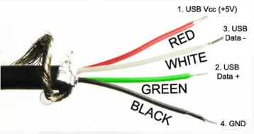
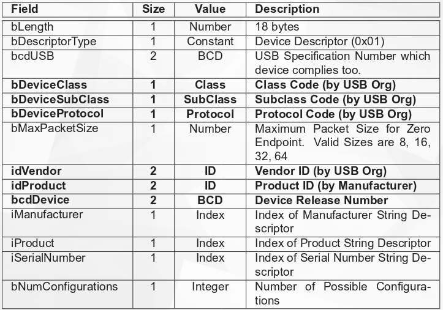
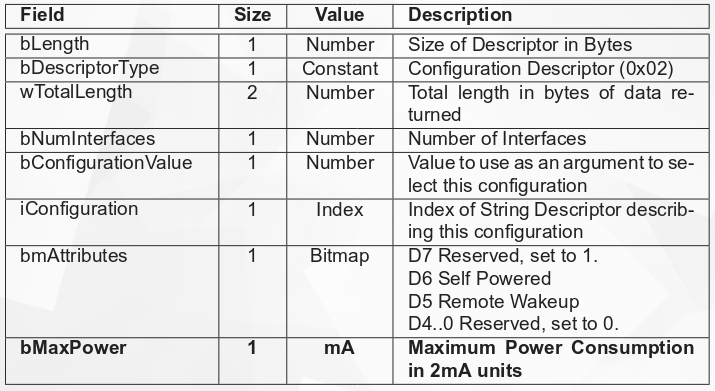
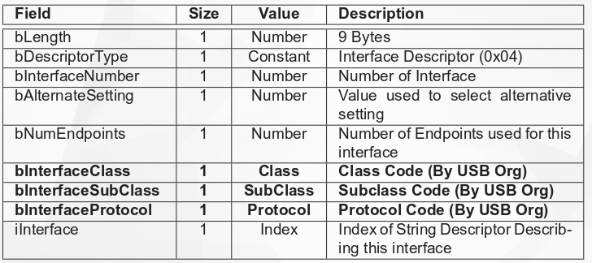
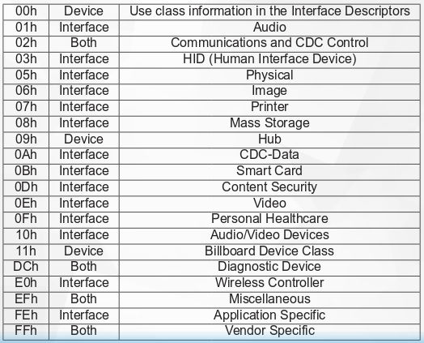

# USB

The usb us a differential pair. 

The usb device is a piece of HW which implements the USB protocol.
A Device may have up to 31 endpoints, each of them gets a unique endpoint address.
Endpoint 0 may transfer data in both directios, all other endpoints may transfer
data in one direction:

- IN: Transfer data from the device to host
- OUT: Transfer data from host to device

### Endpoint Types

#### Host

* Can be extended using some devices
* Has a type-A connector

#### Device

* May extend USB host with some functionalities
* Has type-b connector (?)

- Control
  - Bi-directional endpoint
  - Used for enumeration
  - Can be used for application

- Interrupt
  - Transfers a small amount of low-latency data
  - reservers bandwidth on the bus
  - Used for time sensitive data

- Bulk
  - Used for large data transfers
  - Used for large, time insensitive data (Network pkgs, Mass storage)
  - Does not reserve bandwidth on bus, uses whatever time is left

- Isochronous
  - Transfers a large amounth of time-sensitive data
  - Delivery is not guaranteed (no ACKs are sent)
  - Used for audio and video stream
  - Late data is as good as no data
  - Better to dro a frame than to delay an force a re-transmision

### Low level

- USB is a host controlled bus
- Nothing happens on the bus unless is started by the host
- Devices cannto initiate any communication
- The USB is a polled bus
- The Host polls each device, requesting data or sending data

### Plug and play

Steps in the plug and play process:

- Plug in device 
- detect connection
- Set address
  - On plug-in device use default address `0x00`
  - Only one device is enumerated at once
  - Hosts assigns unique address for new device
- Get device info
  - Each usb world entity is described by data structure called descriptor
  - descriptors have different types, sizes and content, but a common header
- Choose a device driver 
- Choose configuration
- Choose drivers for interface

##### Device descriptor

##### Configuration descriptor

##### interface descriptor

##### Usb clases

#### Device info summary

Host gets info about new devies from suitable USB descriptor, the most relevant:

- `idVendor`
- `idProduct`
- `bcdDevice`
- `bDeviceClass`
- `bDeviceSubClass`
- `bDeviceProtocol`
- `bMaxPower`
- `bInterfaceClass`
- `bInterfaceSubClass`
- `bInterfaceProtocol`

#### Set configuration

Which configuration is the most situable?

- Do we have enough power for it? (bMaxPower)
- It has at least one interface
- If device has only one config use it
- Choose the one which first interface is not vendor specific

### How to choose a suitable driver?

- `struct usb_driver` vs `struct usb_device_driver`

- When device needs special handling
  - using VID and PID and interface ID
  - Driver probes for each interface in device that match VID and PID
- When driver implements some well defined, standardized protocol
  - Using `bInterfaceClass`, `bInterfaceSubClass` etc.
  - Driver probes for each interface which has suitable identity
  - No matter what is the VID and PID
  - Driver will not match if the interface hasn't suitable class

Now that we have a driver that provides some interface to user space,
depends on the interface type what is the next step.

- Network devices: Network manager should handle new interfaces set-up.
- Pendrives, disks, etc: Automount services should mount new block device.
- Mouse, keyboard: X11 events will start listening for input events

### USB security summary

* Between plug in and start using there is no user interaction
* Drivers are probed automatically
* User space starts using new device automatically
* device introduces itself as it wants
* There is not relation between physicall outfit and description

##### Attack scenario

* The user connects a hacked device
* Device looks like a pendrive
* The device sends descriptor taken from a keyboard
* The device implements HID protocol
* Kernel creates new input source
* X11 starts to use that device as a keyboard
